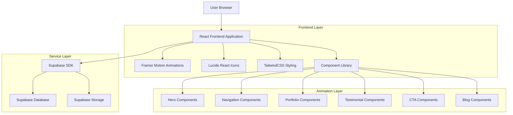
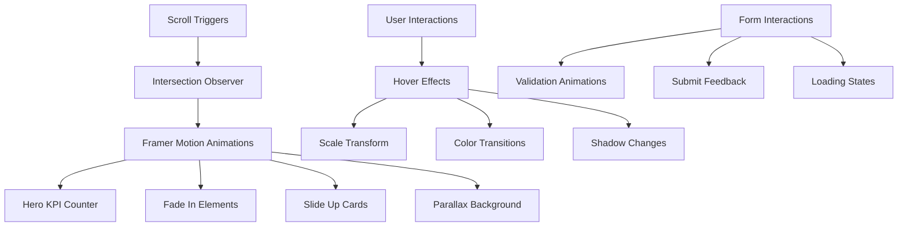
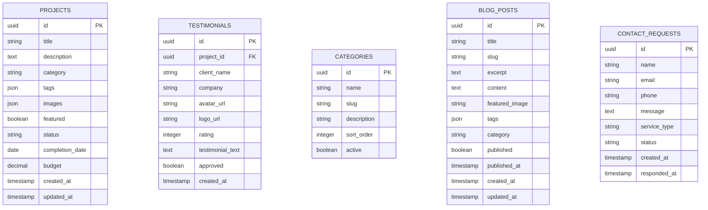

## 1. Architecture Design



## 2. Technology Description

**Frontend Stack:**
- React@18 + Vite para desarrollo rápido y eficiente
- TailwindCSS@3 para estilos utilitarios y responsive design
- Framer Motion para animaciones avanzadas y microinteracciones
- Lucide React para iconografía moderna y consistente
- React Router DOM para navegación SPA

**Initialization Tool:**
- Vite-init (ya configurado en el proyecto existente)

**Backend Services:**
- Supabase para autenticación, base de datos y almacenamiento
- No backend adicional requerido - arquitectura JAMstack

**Librerías Adicionales:**
- Swiper.js para carruseles touch-friendly
- React Hook Form para formularios optimizados
- React Intersection Observer para animaciones scroll-triggered
- React CountUp para animaciones de números KPI

## 3. Route Definitions

| Route | Purpose |
|-------|---------|
| / | Home page modernizada con todas las secciones interactivas |
| /servicios | Página de servicios con detalles de cada especialidad |
| /proyectos | Portfolio completo con filtros y galería ampliada |
| /nosotros | Información de la empresa y equipo |
| /contacto | Formulario de contacto con integración WhatsApp |
| /blog | Listado de publicaciones con categorías y búsqueda |
| /blog/:slug | Detalle de publicación individual |

## 4. Component Architecture

### 4.1 Core Components

**Hero Section Components:**
```typescript
interface HeroSectionProps {
  kpiData: {
    years: number;
    projects: number;
    clients: number;
  };
  backgroundMedia: {
    type: 'image' | 'video';
    url: string;
    overlay?: number;
  };
  title: string;
  subtitle: string;
}
```

**Navigation Components:**
```typescript
interface NavbarProps {
  variant: 'sticky' | 'sidebar';
  items: NavItem[];
  searchEnabled: boolean;
  ctaButton: CTAButton;
}

interface NavItem {
  label: string;
  href: string;
  icon?: React.ComponentType;
  submenu?: NavItem[];
}
```

**Portfolio Components:**
```typescript
interface ProjectCardProps {
  project: {
    id: string;
    title: string;
    category: string;
    tags: string[];
    image: string;
    description: string;
    testimonial?: Testimonial;
  };
  layout: 'grid' | 'carousel';
  onFilter: (category: string) => void;
}
```

**Testimonial Components:**
```typescript
interface TestimonialSliderProps {
  testimonials: Array<{
    id: string;
    client: string;
    company?: string;
    avatar?: string;
    logo?: string;
    rating: number;
    text: string;
    project?: string;
  }>;
  autoPlay: boolean;
  interval: number;
  animationType: 'fade' | 'slide' | 'zoom';
}
```

## 5. Animation System



### 5.1 Animation Specifications

**Hero KPI Animation:**
- Counter animation con duración 2-3 segundos
- Easing: easeOutCubic
- Trigger: cuando el elemento entra en viewport
- Formato números: separador de miles, símbolo "+"

**Scroll Reveal Animations:**
- Offset: 20% del viewport
- Umbral: 0.1-0.3
- Duración: 0.6-0.8 segundos
- Delay escalonado para elementos múltiples

**Microinteracciones Hover:**
- Scale: 1.02-1.05
- Transition: 0.3s ease-in-out
- Color shift: 10-20% lighter/darker
- Shadow enhancement: de md a lg

## 6. Data Model

### 6.1 Database Schema



### 6.2 Data Definition Language

**Projects Table:**
```sql
CREATE TABLE projects (
    id UUID PRIMARY KEY DEFAULT gen_random_uuid(),
    title VARCHAR(255) NOT NULL,
    description TEXT,
    category VARCHAR(100) NOT NULL,
    tags JSONB DEFAULT '[]',
    images JSONB DEFAULT '[]',
    featured BOOLEAN DEFAULT false,
    status VARCHAR(50) DEFAULT 'completed',
    completion_date DATE,
    budget DECIMAL(10,2),
    created_at TIMESTAMP WITH TIME ZONE DEFAULT NOW(),
    updated_at TIMESTAMP WITH TIME ZONE DEFAULT NOW()
);

CREATE INDEX idx_projects_category ON projects(category);
CREATE INDEX idx_projects_featured ON projects(featured) WHERE featured = true;
CREATE INDEX idx_projects_status ON projects(status);
```

**Testimonials Table:**
```sql
CREATE TABLE testimonials (
    id UUID PRIMARY KEY DEFAULT gen_random_uuid(),
    project_id UUID REFERENCES projects(id),
    client_name VARCHAR(255) NOT NULL,
    company VARCHAR(255),
    avatar_url TEXT,
    logo_url TEXT,
    rating INTEGER CHECK (rating >= 1 AND rating <= 5),
    testimonial_text TEXT NOT NULL,
    approved BOOLEAN DEFAULT false,
    created_at TIMESTAMP WITH TIME ZONE DEFAULT NOW()
);

CREATE INDEX idx_testimonials_project ON testimonials(project_id);
CREATE INDEX idx_testimonials_approved ON testimonials(approved) WHERE approved = true;
CREATE INDEX idx_testimonials_rating ON testimonials(rating);
```

**Blog Posts Table:**
```sql
CREATE TABLE blog_posts (
    id UUID PRIMARY KEY DEFAULT gen_random_uuid(),
    title VARCHAR(255) NOT NULL,
    slug VARCHAR(255) UNIQUE NOT NULL,
    excerpt TEXT,
    content TEXT NOT NULL,
    featured_image TEXT,
    tags JSONB DEFAULT '[]',
    category VARCHAR(100),
    published BOOLEAN DEFAULT false,
    published_at TIMESTAMP WITH TIME ZONE,
    created_at TIMESTAMP WITH TIME ZONE DEFAULT NOW(),
    updated_at TIMESTAMP WITH TIME ZONE DEFAULT NOW()
);

CREATE INDEX idx_blog_posts_slug ON blog_posts(slug);
CREATE INDEX idx_blog_posts_published ON blog_posts(published) WHERE published = true;
CREATE INDEX idx_blog_posts_category ON blog_posts(category);
```

### 6.3 Supabase Row Level Security (RLS)

**Projects Policy:**
```sql
-- Allow public read access to published projects
CREATE POLICY "Public can view published projects" ON projects
    FOR SELECT USING (status = 'completed');

-- Allow authenticated users to view all projects
CREATE POLICY "Authenticated users can view all projects" ON projects
    FOR SELECT USING (auth.role() = 'authenticated');
```

**Testimonials Policy:**
```sql
-- Allow public read access to approved testimonials
CREATE POLICY "Public can view approved testimonials" ON testimonials
    FOR SELECT USING (approved = true);
```

**Blog Posts Policy:**
```sql
-- Allow public read access to published posts
CREATE POLICY "Public can view published posts" ON blog_posts
    FOR SELECT USING (published = true AND published_at <= NOW());
```

## 7. Performance Optimization

### 7.1 Image Optimization
- Implementar lazy loading para todas las imágenes
- Usar formatos WebP con fallback a JPEG/PNG
- Generar múltiples tamaños para diferentes breakpoints
- Implementar blur-up technique para mejores LCP scores

### 7.2 Animation Performance
- Usar CSS transforms en lugar de position changes
- Implementar will-change para elementos animados
- Limitar animaciones en dispositivos móviles
- Usar requestAnimationFrame para animaciones complejas

### 7.3 Bundle Optimization
- Code splitting por rutas y componentes pesados
- Tree shaking para eliminar código no utilizado
- Optimizar imports de librerías (lodash, framer-motion)
- Implementar service workers para caché offline

## 8. SEO y Accesibilidad

### 8.1 SEO Técnico
- Implementar React Helmet para meta tags dinámicos
- Estructura de datos JSON-LD para proyectos y testimonios
- Sitemap dinámico generado desde Supabase
- Optimización Core Web Vitals (LCP, FID, CLS)

### 8.2 Accesibilidad (WCAG 2.1 AA)
- Contraste mínimo 4.5:1 para texto normal
- Contraste 3:1 para texto grande
- Navegación completa por teclado
- Screen reader friendly con ARIA labels
- Focus indicators visibles
- Saltar navegación para contenido principal