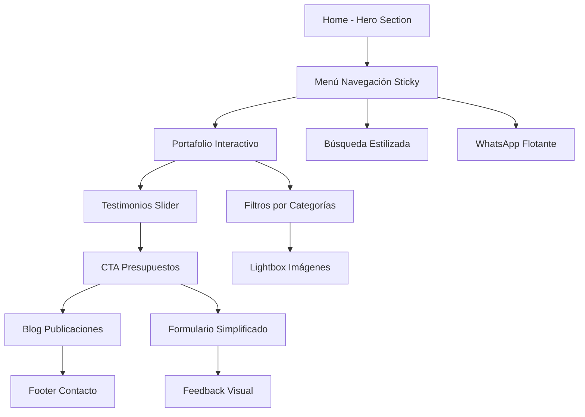

## 1. Product Overview
Modernización integral de la página de inicio de Unamunzaga Obras, transformando la experiencia visual e interactiva para público doméstico y profesional (arquitectos y expertos en reformas). El objetivo es crear una Home contemporánea que transmita confianza, innovación y experiencia mediante microinteracciones modernas, diseño premium y navegación intuitiva.

- **Público objetivo**: Particulares, arquitectos y expertos en reformas en Bilbao
- **Valor principal**: Transformar espacios con más de 20 años de experiencia y 10.000+ proyectos ejecutados
- **Diferenciador**: Profesionalismo, elegancia y confianza con tecnología moderna

## 2. Core Features

### 2.1 User Roles
| Role | Registration Method | Core Permissions |
|------|---------------------|------------------|
| Visitor | No registration required | Browse all content, view portfolio, request quotes |
| Professional Client | Email/Phone contact | Access detailed project information, technical specifications |
| Admin | Secure backend login | Manage projects, testimonials, blog content |

### 2.2 Feature Module
La modernización de la Home incluye las siguientes secciones principales:

1. **Menú principal moderno**: Navegación sticky/lateral minimalista con microinteracciones, pictogramas y CTA prominente
2. **Hero section premium**: Texto simplificado, KPIs animados (20+ años, 10.000+ proyectos), imagen/video full-screen con overlay
3. **Portafolio interactivo**: Grid responsive con carrousel moderno, filtros por categorías, lightbox y testimonios asociados
4. **Valores y testimonios**: Slider automático/manual con clientes, logos y valoraciones
5. **CTA presupuestos**: Formulario simplificado con sellos de garantía y feedback visual
6. **Blog y publicaciones**: Tarjetas visuales con filtros SEO y acceso rápido
7. **Footer moderno**: Bloques visuales con contacto, redes, mapa y FAQ
8. **Elementos flotantes**: Botón WhatsApp/chat y efectos de scroll

### 2.3 Page Details
| Page Name | Module Name | Feature description |
|-----------|-------------|---------------------|
| Home - Menú Principal | Navegación sticky/lateral | Implementar menú pegajoso con microinteracciones modernas (hover, selección, animación color/acento). Sustituir elementos clásicos por pictogramas sutiles. Añadir buscador estilizado y CTA "Solicita presupuesto" |
| Home - Hero Section | Mensaje principal simplificado | Texto conciso: "Más de 20 años transformando espacios en Bilbao para clientes exigentes: particulares y profesionales. Confía en los expertos con más de 10.000 proyectos ejecutados." KPIs animados con tipografía XL, imagen/video full-screen con overlay translúcido |
| Home - Portafolio | Grid de proyectos destacados | Implementar galería responsive con carrousel moderno, animaciones hover (info reveal, logo, resultado). Sistema de filtrado por categorías (Viviendas, Bares, Restaurantes) con etiquetas interactivas PREMIUM, HISTÓRICO. Lightbox para ampliar imágenes |
| Home - Testimonios | Slider de clientes | Implementar slider automático/manual con foto del cliente, logo empresa, frase destacada, valoración estrellas. Paleta colores neutros con detalles vibrantes. Transiciones animadas (fade-in, slide, zoom) |
| Home - CTA Presupuestos | Formulario destacado | Crear bloque con color acento moderno y formulario simplificado (nombre, email, descripción breve). Animación botón con icono WhatsApp/mensaje. Sellos "Respuesta <24h", "Asesoría gratuita" |
| Home - Blog | Publicaciones recientes | Tarjetas visuales con imagen portada, resumen snippet y hover animado. Filtro superior por categorías SEO ("Reformas integrales", "Casos de éxito", "Colaboraciones"). CTA acceso más publicaciones |
| Home - Footer | Bloques de confianza | Separar en bloques visuales: contacto rápido (teléfono, WhatsApp, email), redes sociales con iconos modernos, Google Maps embebido, horarios y FAQ breve. Slider dinámico con logos clientes |
| Home - Elementos Flotantes | Contacto directo | Botón flotante/barra lateral para contacto rápido (chat/ WhatsApp). Efectos entrada/desplazamiento (scroll reveal, fade-in, parallax ligero) |

## 3. Core Process

### Flujo de Usuario Principal
1. **Usuario llega a Home** → Hero section con KPIs animados capta atención
2. **Explora navegación** → Menú sticky con pictogramas y microinteracciones
3. **Visualiza portafolio** → Grid interactivo con filtros y lightbox
4. **Lee testimonios** → Slider automático con clientes satisfechos
5. **Solicita presupuesto** → Formulario simplificado con feedback visual
6. **Accede a blog** → Tarjetas visuales con contenido relevante
7. **Contacta empresa** → Footer con múltiples canales de contacto

## 4. User Interface Design

### 4.1 Design Style
**Colores principales:**
- Primario: Azul profesional (#1E3A8A) con variaciones
- Secundario: Dorado elegante (#F59E0B) para acentos
- Neutros: Grises modernos (#6B7280, #374151)
- Fondos: Blanco puro (#FFFFFF) y gris claro (#F9FAFB)

**Tipografía:**
- Fuente principal: Sans-serif moderna (Inter, Roboto)
- Títulos: Tamaños XL-2XL (48-72px) con peso bold
- Cuerpo: Tamaño base 16px con buena legibilidad
- KPIs: Tamaños extra grandes (96px+) para impacto visual

**Elementos interactivos:**
- Botones: Estilo redondeado con sombras sutiles
- Microinteracciones: Transiciones suaves (0.3s ease-in-out)
- Hover effects: Cambio de color, scale(1.05), sombras
- Animaciones: Fade-in, slide-up, counter animations

**Iconografía:**
- Estilo lineal moderno (Lucide React icons)
- Tamaños consistentes (24-32px)
- Colores de acento en hover

### 4.2 Page Design Overview
| Page Name | Module Name | UI Elements |
|-----------|-------------|-------------|
| Home - Hero | KPIs animados | Tipografía XL (96px+) para números, animación contador, fade-in progresivo, overlay oscuro 60% sobre imagen/video |
| Home - Menú | Navegación sticky | Background blanco/opaco al scroll, pictogramas 24px, microinteracciones color azul/dorado, buscador minimalista |
| Home - Portafolio | Grid proyectos | Cards con border-radius 12px, sombra box-shadow-md, hover reveal info, etiquetas PREMIUM doradas, lightbox fullscreen |
| Home - Testimonios | Slider clientes | Cards neutras con bordes suaves, fotos redondeadas 48px, estrellas doradas, transiciones fade-in 0.5s |
| Home - CTA | Formulario contacto | Background gradient azul-profesional, botón WhatsApp verde (#25D366), iconos animados, feedback visual inmediato |
| Home - Blog | Tarjetas publicaciones | Imágenes 16:9 con overlay texto, hover scale(1.02), categorías con pills redondeados, sombras sutiles |
| Home - Footer | Bloques contacto | Grid responsive 3-4 columnas, iconos modernos 20px, Google Maps iframe pequeño, colores neutros con acentos |

### 4.3 Responsiveness
- **Desktop-first approach**: Diseño optimizado para pantallas grandes (1920px+)
- **Breakpoints**: 1536px, 1280px, 1024px, 768px, 640px
- **Mobile adaptation**: Menú hamburger, cards apiladas, tipografía adaptable
- **Touch optimization**: Botones mínimo 44px, espaciado generoso
- **Performance**: Imágenes responsive (srcset), lazy loading, animaciones condicionales