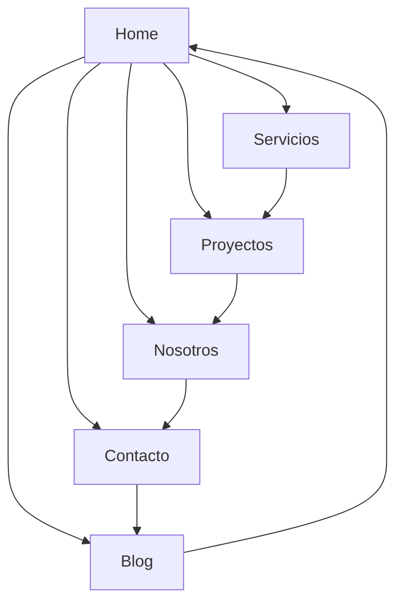

## 1. Product Overview
Conversión de la web de Unamunzaga Obras en una plataforma SPA (Single Page Application) moderna y totalmente modularizada. La navegación entre páginas se realiza dentro de la aplicación React sin recargas, manteniendo coherencia visual y UX en todas las secciones.

- Problema a resolver: Web estática con recargas de página y experiencia de usuario fragmentada
- Usuarios objetivo: Clientes potenciales, empresas constructoras, arquitectos y público general interesado en servicios de construcción
- Valor: Experiencia de navegación instantánea, profesional y moderna que mejora la percepción de la marca

## 2. Core Features

### 2.1 User Roles
No se requiere distinción de roles para esta versión. Todos los usuarios son visitantes anónimos que pueden navegar libremente por el contenido.

### 2.2 Feature Module
La plataforma SPA consta de las siguientes páginas principales:
1. **Home**: Presentación principal, servicios destacados, proyectos recientes y información de contacto
2. **Servicios**: Detalle de todos los servicios de construcción ofrecidos por la empresa
3. **Proyectos**: Galería de proyectos realizados con información detallada
4. **Nosotros**: Historia de la empresa, equipo y valores
5. **Contacto**: Formulario de contacto e información de ubicación
6. **Blog**: Artículos y noticias relacionadas con la construcción

### 2.3 Page Details
| Page Name | Module Name | Feature description |
|-----------|-------------|---------------------|
| Home | Hero section | Carrusel de imágenes principales con textos animados y call-to-action |
| Home | Servicios destacados | Grid de cards con servicios principales con hover effects |
| Home | Proyectos recientes | Galería minimalista de últimos proyectos con link a página completa |
| Home | Contacto rápido | Formulario abreviado y datos de contacto destacados |
| Servicios | Lista de servicios | Grid responsive con cards de servicios, iconos y descripciones |
| Servicios | Detalle de servicio | Modal o sección expandible con información completa |
| Proyectos | Galería de proyectos | Grid filtrable por categorías con imágenes y títulos |
| Proyectos | Detalle de proyecto | Página individual con galería de imágenes, descripción y especificaciones |
| Nosotros | Historia | Timeline o sección narrativa de la empresa |
| Nosotros | Equipo | Cards de miembros del equipo con fotos y cargos |
| Nosotros | Valores | Sección de valores corporativos con iconografía |
| Contacto | Formulario de contacto | Campos para nombre, email, teléfono, asunto y mensaje con validación |
| Contacto | Información de contacto | Dirección, teléfono, email y horarios de atención |
| Contacto | Mapa de ubicación | Integración de mapa interactivo |
| Blog | Lista de artículos | Cards con imagen, título, fecha y extracto |
| Blog | Artículo individual | Contenido completo con imágenes, texto y navegación entre artículos |
| Global | Navbar | Navegación principal con logo y menú responsive |
| Global | Footer | Información de contacto, enlaces rápidos y redes sociales |

## 3. Core Process
**Flujo de navegación principal:**
El usuario accede a la web y puede navegar instantáneamente entre todas las secciones mediante el menú principal. Cada cambio de página ocurre sin recarga del navegador, con transiciones suaves entre contenidos.

## 4. User Interface Design

### 4.1 Design Style
- **Colores primarios**: Azul industrial (#1E3A8A), Gris oscuro (#374151)
- **Colores secundarios**: Blanco (#FFFFFF), Gris claro (#F3F4F6)
- **Botones**: Estilo moderno con bordes redondeados y sombras sutiles
- **Tipografía**: Fuente sans-serif moderna (Inter o similar), tamaños responsive
- **Layout**: Diseño basado en cards con grid system flexible
- **Iconos**: Estilo lineal minimalista consistente en toda la plataforma

### 4.2 Page Design Overview
| Page Name | Module Name | UI Elements |
|-----------|-------------|-------------|
| Home | Hero section | Carrusel full-width con imágenes de alta calidad, textos superpuestos con animación fade-in, botones CTA prominentes |
| Servicios | Service cards | Grid de 3 columnas en desktop, 1 en mobile, cards con iconos, títulos y descripciones, hover effect con elevación |
| Proyectos | Project gallery | Masonry grid o layout uniforme, imágenes con overlay de información al hover, categorías filtrables |
| Contacto | Contact form | Formulario moderno con campos de entrada estilizados, botón de envío con estado de carga, validación visual inline |

### 4.3 Responsiveness
Diseño desktop-first que se adapta perfectamente a tablets y móviles. Breakpoints estándar (640px, 768px, 1024px, 1280px). Menú hamburger en móvil con animación suave. Touch optimization para todos los elementos interactivos.