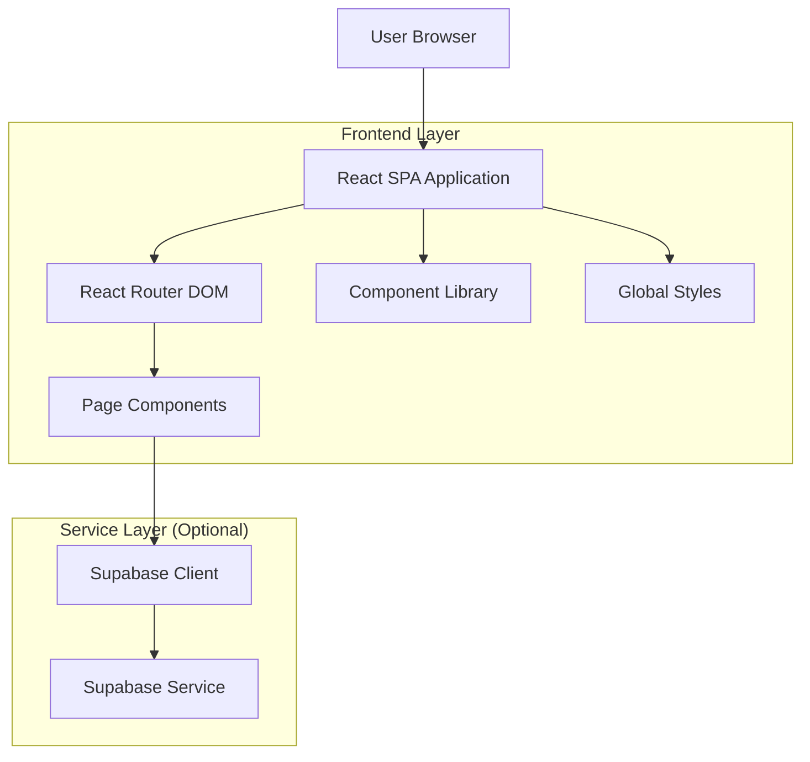

## 1. Architecture design

## 2. Technology Description
- Frontend: React@18 + tailwindcss@3 + vite
- Initialization Tool: vite-init
- Routing: React Router DOM@6
- Animations: Framer Motion
- Backend: None (estático por ahora, Supabase opcional para futuras features)
- Build Tool: Vite@4

## 3. Route definitions
| Route | Purpose |
|-------|---------|
| / | Home page, landing principal con hero section y servicios destacados |
| /servicios | Página de servicios, lista completa de servicios de construcción |
| /proyectos | Galería de proyectos realizados con filtros por categoría |
| /proyectos/:id | Detalle individual de proyecto con galería de imágenes |
| /nosotros | Página de información de la empresa, historia y equipo |
| /contacto | Formulario de contacto e información de ubicación |
| /blog | Lista de artículos y noticias |
| /blog/:slug | Artículo individual del blog |

## 4. API definitions
No se requieren APIs en esta fase. El contenido será estático o gestionado mediante archivos JSON locales.

## 5. Server architecture diagram
No aplica para esta implementación SPA estática. El build genera archivos estáticos servidos por CDN o hosting estático.

## 6. Data model
No se requiere base de datos en esta fase. Los datos pueden ser gestionados mediante:
- Archivos JSON estáticos para proyectos y servicios
- Markdown files para contenido del blog
- Formulario de contacto puede usar servicio externo (Formspree, EmailJS) o implementarse con backend futuro